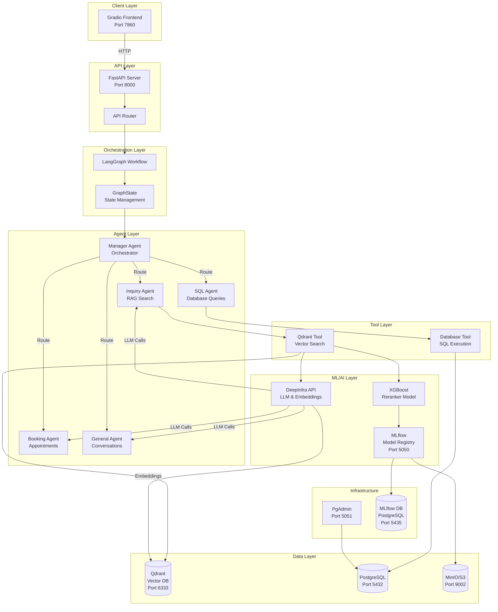

# 🏗️ Zenith AI - System Architecture

## Table of Contents

- [Overview](#overview)
- [System Architecture Diagram](#system-architecture-diagram)
- [Component Details](#component-details)
- [Data Flow](#data-flow)
- [Technology Choices](#technology-choices)
- [Deployment Architecture](#deployment-architecture)
- [Security Considerations](#security-considerations)
- [Scalability & Performance](#scalability--performance)

## Overview

Zenith AI is built on a microservices architecture that combines multiple specialized components to deliver an intelligent, multi-agent front desk system. The architecture emphasizes modularity, scalability, and maintainability.

### Key Architectural Principles

- **Separation of Concerns**: Each component has a single, well-defined responsibility
- **Agent-Based Design**: Specialized agents handle different types of tasks
- **State Management**: Centralized state management using LangGraph
- **Async-First**: Built with async/await for optimal performance
- **Containerization**: All services are containerized for easy deployment

## System Architecture Diagram



## Component Details

### 1. Frontend Layer

#### Gradio UI (`frontend/main.py`)
- **Purpose**: Interactive web interface for user interactions
- **Technology**: Gradio 6.0+
- **Features**:
  - Real-time chat interface
  - Streaming response display
  - Session management
  - Thread-based conversations

**Key Responsibilities**:
- User input collection
- Response streaming and display
- Session state management
- Error handling and user feedback

### 2. API Layer

#### FastAPI Server (`core/main.py`)
- **Purpose**: RESTful API gateway
- **Technology**: FastAPI 0.124+
- **Features**:
  - Async request handling
  - CORS middleware
  - Health check endpoints
  - Streaming responses

**Endpoints**:
- `GET /` - Root endpoint
- `GET /api/v1/health` - Health check
- `POST /api/v1/chat` - Chat endpoint (streaming)

**Key Responsibilities**:
- Request validation
- Response formatting
- Error handling
- Graph initialization

### 3. Orchestration Layer

#### LangGraph Workflow (`graph/workflow.py`)
- **Purpose**: Multi-agent workflow orchestration
- **Technology**: LangGraph 1.0+
- **Architecture**: State-based graph with conditional routing

**Workflow Structure**:
```
START → Manager → [Conditional Routing]
                    ├─→ Inquiry → END
                    ├─→ Booking → Manager → ...
                    ├─→ General → END
                    ├─→ Database → END
                    └─→ END (FINISH)
```

**State Management** (`graph/state.py`):
```python
GraphState:
  - messages: List[AnyMessage]  # Conversation history
  - query: str                   # Current user query
  - next_step: str               # Routing decision
  - booking_details: dict         # Booking information
  - booking_active: bool          # Booking status
```

**Key Features**:
- State persistence with MemorySaver
- Conditional edge routing
- Thread-based conversation tracking
- Automatic graph visualization

### 4. Agent Layer

#### Manager Agent (`graph/agent/manager.py`)
- **Purpose**: Central orchestrator and router
- **Responsibilities**:
  - Analyze user intent
  - Route to appropriate specialist agent
  - Manage conversation flow
  - Determine completion status

**Routing Logic**:
- Analyzes query intent
- Determines next step: `INQUIRY`, `BOOKING`, `DATABASE`, `GENERAL`, or `FINISH`
- Updates state with routing decision

#### Inquiry Agent (`graph/agent/inquiry.py`)
- **Purpose**: Handle information requests using RAG
- **Responsibilities**:
  - Process user inquiries
  - Trigger knowledge base search
  - Synthesize responses from retrieved documents
  - Provide accurate, context-aware answers

**Workflow**:
1. Receive query from Manager
2. Call `search_knowledge_base` tool
3. Process retrieved documents
4. Generate response using LLM
5. Return to Manager

#### Booking Agent (`graph/agent/booking.py`)
- **Purpose**: Manage appointment scheduling
- **Responsibilities**:
  - Extract booking details from conversation
  - Validate booking information
  - Execute booking operations
  - Handle booking modifications

**State Management**:
- Tracks `booking_details` in state
- Manages `booking_active` flag
- Returns to Manager for follow-up routing

#### General Agent (`graph/agent/general.py`)
- **Purpose**: Handle general conversations
- **Responsibilities**:
  - Process casual queries
  - Provide friendly responses
  - Handle FAQs
  - Maintain conversation context

#### SQL Agent (`graph/agent/sql.py`)
- **Purpose**: Execute database queries
- **Responsibilities**:
  - Generate SQL queries from natural language
  - Execute queries safely
  - Format results
  - Handle errors gracefully

### 5. Tool Layer

#### Qdrant Tool (`graph/tools/qdrant.py`)
- **Purpose**: Semantic search over knowledge base
- **Technology**: Qdrant vector database + XGBoost reranking

**Search Pipeline**:
1. **Query Embedding**: Convert query to vector using DeepInfra
2. **Vector Search**: Retrieve top 40 candidates from Qdrant
3. **Feature Extraction**: Extract reranking features
4. **Reranking**: Score and rerank using XGBoost model
5. **Top-K Selection**: Return top 5 most relevant documents

**Features**:
- Semantic similarity search
- Hybrid scoring (vector + reranker)
- MLflow model integration
- Fallback to vector-only search

#### Database Tool (`graph/tools/database.py`)
- **Purpose**: Execute SQL queries
- **Technology**: SQLAlchemy + PostgreSQL

**Features**:
- Safe query execution
- Result formatting
- Error handling
- Connection pooling

### 6. Data Layer

#### Qdrant Vector Database
- **Purpose**: Store and search document embeddings
- **Port**: 6333 (HTTP), 6334 (gRPC)
- **Collection**: `zenith_collection`
- **Features**:
  - High-performance vector search
  - Payload storage
  - Filtering capabilities
  - Horizontal scaling support

**Data Structure**:
```json
{
  "id": "uuid",
  "vector": [0.1, 0.2, ...],
  "payload": {
    "full_text": "document content",
    "h1": "section header",
    "metadata": {...}
  }
}
```

#### PostgreSQL
- **Purpose**: Relational data storage
- **Port**: 5432
- **Use Cases**:
  - Booking records
  - User data
  - Application metadata
  - Transaction logs

#### MinIO (S3-compatible)
- **Purpose**: Object storage for ML artifacts
- **Port**: 9000 (API), 9001 (Console)
- **Bucket**: `mlartifacts`
- **Use Cases**:
  - MLflow model artifacts
  - Training data
  - Model checkpoints

### 7. ML/AI Layer

#### DeepInfra Integration
- **Purpose**: LLM and embedding model hosting
- **Models**:
  - **Embedding**: `Qwen/Qwen3-Embedding-8B`
  - **Chat**: Configurable (via `DEEPINFRA_CHAT_MODEL`)

**Features**:
- High-performance inference
- Cost-effective API
- Multiple model support
- Async API calls

#### MLflow
- **Purpose**: Model lifecycle management
- **Port**: 5050
- **Features**:
  - Model versioning
  - Experiment tracking
  - Model registry
  - Artifact storage

**Model Registry**:
- **Reranker Model**: `XGBoostReranker`
  - Staging/Production versions
  - Automatic loading from registry
  - Version tracking

#### XGBoost Reranker
- **Purpose**: Improve search relevance
- **Technology**: XGBoost 3.1+
- **Features**:
  - Learned-to-rank model
  - Feature-based reranking
  - MLflow integration
  - Automatic model loading

## Data Flow

### 1. User Query Flow

```
User Input (Gradio)
    ↓
HTTP POST /api/v1/chat
    ↓
FastAPI Router
    ↓
LangGraph Workflow
    ↓
Manager Agent (Intent Analysis)
    ↓
[Routing Decision]
    ├─→ Inquiry Agent
    │       ↓
    │   Qdrant Tool (Vector Search)
    │       ↓
    │   DeepInfra (Embedding)
    │       ↓
    │   Qdrant (Retrieve Documents)
    │       ↓
    │   XGBoost (Rerank)
    │       ↓
    │   DeepInfra (LLM Response)
    │       ↓
    │   Stream Response
    │
    ├─→ Booking Agent
    │       ↓
    │   Extract Details
    │       ↓
    │   Database Tool
    │       ↓
    │   PostgreSQL
    │       ↓
    │   Stream Response
    │
    └─→ SQL Agent
            ↓
        Database Tool
            ↓
        PostgreSQL
            ↓
        Stream Response
```

### 2. Knowledge Base Search Flow

```
Query Text
    ↓
DeepInfra Embedding API
    ↓
Query Vector (768-dim)
    ↓
Qdrant Vector Search (Top 40)
    ↓
Candidate Documents
    ↓
Feature Extraction
    ↓
XGBoost Reranker (MLflow)
    ↓
Reranked Results (Top 5)
    ↓
LLM Context
    ↓
Final Response
```

### 3. Model Loading Flow

```
Application Startup
    ↓
MLflow Client Initialization
    ↓
Query Model Registry
    ↓
Get Latest Staging Version
    ↓
Load Model from S3 (MinIO)
    ↓
Cache in Memory
    ↓
Ready for Inference
```

## Technology Choices

### Why LangGraph?
- **State Management**: Built-in state persistence and management
- **Workflow Orchestration**: Visual, declarative workflow definition
- **Agent Coordination**: Seamless multi-agent communication
- **Checkpointing**: Conversation state persistence
- **Extensibility**: Easy to add new agents and tools

### Why Qdrant?
- **Performance**: High-speed vector search
- **Scalability**: Horizontal scaling support
- **Features**: Rich filtering and payload capabilities
- **Open Source**: Self-hostable and cost-effective
- **LangChain Integration**: Native LangChain support

### Why FastAPI?
- **Performance**: Async-first, high throughput
- **Type Safety**: Pydantic validation
- **Documentation**: Auto-generated OpenAPI docs
- **Modern**: Built on Python type hints
- **Ecosystem**: Rich middleware and extensions

### Why MLflow?
- **Model Management**: Versioning and registry
- **Experiment Tracking**: Reproducible ML workflows
- **Deployment**: Easy model serving
- **Integration**: Works with any ML framework
- **UI**: Built-in tracking UI

### Why Docker Compose?
- **Isolation**: Service isolation and dependency management
- **Reproducibility**: Consistent environments
- **Development**: Easy local development setup
- **Deployment**: Production-ready containerization
- **Networking**: Automatic service discovery

## Deployment Architecture

### Development Environment

```
┌─────────────────────────────────────────┐
│         Local Development               │
├─────────────────────────────────────────┤
│  FastAPI (uvicorn --reload)             │
│  Gradio (python frontend/main.py)       │
│  Docker Compose (Infrastructure only)   │
└─────────────────────────────────────────┘
```

### Production Environment

```
┌─────────────────────────────────────────┐
│         Docker Compose Stack            │
├─────────────────────────────────────────┤
│  ┌──────────┐  ┌──────────┐            │
│  │  FastAPI │  │  Gradio  │            │
│  │  :8000   │  │  :7860   │            │
│  └──────────┘  └──────────┘            │
│                                         │
│  ┌──────────┐  ┌──────────┐            │
│  │  Qdrant  │  │PostgreSQL│            │
│  │  :6333   │  │  :5432   │            │
│  └──────────┘  └──────────┘            │
│                                         │
│  ┌──────────┐  ┌──────────┐            │
│  │  MLflow  │  │  MinIO   │            │
│  │  :5050   │  │  :9002   │            │
│  └──────────┘  └──────────┘            │
└─────────────────────────────────────────┘
```

### Network Architecture

```
zenith_shared_network (Bridge)
    ├─ api_server (if enabled)
    ├─ gradio (if enabled)
    ├─ qdrant
    ├─ db (PostgreSQL)
    ├─ mlflow
    ├─ mlflow_db
    ├─ s3 (MinIO)
    └─ pgadmin
```

**Service Discovery**:
- Services communicate via service names (e.g., `qdrant`, `db`)
- Internal networking for security
- Port mapping for external access

## Security Considerations

### Current Implementation
- **Environment Variables**: Sensitive data in `.env` (not committed)
- **Network Isolation**: Docker network for internal communication
- **CORS**: Configurable CORS middleware
- **Input Validation**: Pydantic models for request validation

### Recommendations for Production
- **API Authentication**: Implement JWT or OAuth2
- **Rate Limiting**: Add rate limiting middleware
- **HTTPS**: Use reverse proxy (nginx/traefik) with SSL
- **Secrets Management**: Use Docker secrets or external secret manager
- **Database Security**: Enable SSL for database connections
- **API Keys**: Secure storage for DeepInfra API tokens
- **Network Policies**: Restrict network access between services

## Scalability & Performance

### Current Limitations
- **Single Instance**: FastAPI and Gradio run as single instances
- **Memory Checkpointer**: LangGraph uses in-memory state (not persistent)
- **Synchronous Tools**: Some tools may block

### Scaling Strategies

#### Horizontal Scaling
- **API Servers**: Deploy multiple FastAPI instances behind load balancer
- **Qdrant**: Use Qdrant cluster mode
- **PostgreSQL**: Read replicas for read-heavy workloads

#### Performance Optimizations
- **Caching**: Add Redis for frequently accessed data
- **Connection Pooling**: Optimize database connection pools
- **Async Operations**: Ensure all I/O operations are async
- **Model Caching**: Cache loaded ML models
- **CDN**: Use CDN for static assets

#### State Persistence
- **PostgreSQL Checkpointer**: Replace MemorySaver with PostgreSQL backend
- **Redis**: Use Redis for session management
- **Distributed State**: Shared state across instances

### Monitoring & Observability

**Recommended Tools**:
- **Prometheus**: Metrics collection
- **Grafana**: Visualization and dashboards
- **ELK Stack**: Log aggregation and analysis
- **Sentry**: Error tracking and alerting
- **MLflow**: Model performance tracking

**Key Metrics**:
- Request latency (p50, p95, p99)
- Error rates
- Agent routing distribution
- Vector search performance
- Model inference latency
- Database query performance

---

## Future Enhancements

### Planned Features
- [ ] Persistent state management (PostgreSQL checkpointer)
- [ ] Authentication and authorization
- [ ] Multi-tenant support
- [ ] Advanced analytics dashboard
- [ ] WebSocket support for real-time updates
- [ ] Model fine-tuning pipeline
- [ ] Automated testing suite
- [ ] CI/CD pipeline

### Research Areas
- [ ] Advanced reranking models (cross-encoders)
- [ ] Hybrid search (keyword + vector)
- [ ] Multi-modal capabilities
- [ ] Agent memory optimization
- [ ] Cost optimization strategies

---

**Last Updated**: 2025-01-27

For questions or contributions, please refer to the main [README.md](./README.md) or open an issue.

